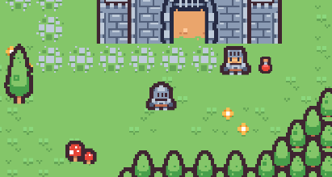

# Plateformer 2D 👾

Welcome to my plateformer 2D !



# Prerequisite ⏪

Somes knowledges in this field : 

- The use of C#
- The use of Unity
- The use of Git and for the code management

# Installation 🔧

1. Clone the repository.
```bash
  git clone https://github.com/MounKilian/ZELDA-LIKE.git
```
2. Reach in the repository.
```bash
  cd ZELDA-LIKE
```

# Features 🔨

This is a Zelda like game:
  - The character can move using the zqsd keys.
  - The character can attack with sword using the a key.
  - The character can attack with bow usinf the e key.
  - The character can use inventory with & and é keys.
Using bow have 1 second of cooldown.

## Ennemies
There are two types of enemies:
  - Golem: More life but less dammage.
  - Ghost: Less life but more dammage. Can fly and doesnt have colliders.

## Objects
There are two types of usable object you can collect:
  - Health Potion: Restore 1/2 heart.
  - Big Health Potion: Restore 1 heart.
Using heal have 2 seconds of cooldown.

## Goal 
  - You have to kill all the ennemies on the map.

# Authors 💸
 - [Kilian Moun 🍻](https://github.com/MounKilian)
